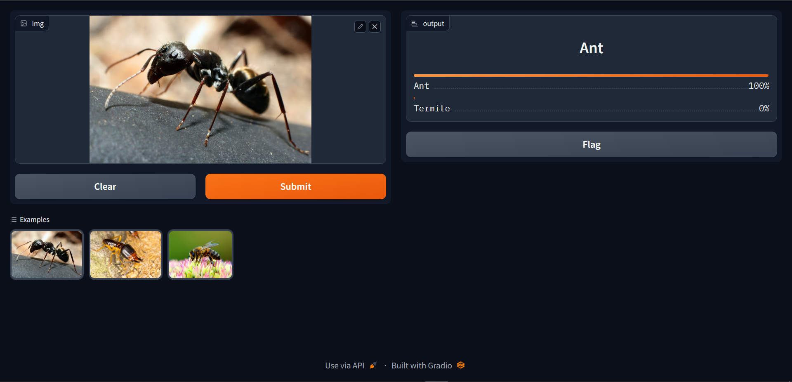

# Finding-ANThony
A binary image classification project using <em><strong>fast.ai</strong></em> and <em><strong>Gradio</strong></em>.   

The aim of the classifier is to distinguish between images of <strong>Ants</strong> and <strong>Termites</strong>.  

This is the link to my Kaggle notebook for the same:  
-    https://www.kaggle.com/code/gautamrmenon/finding-anthony-v2  

Using the fast.ai library, I have created a binary image classifier involving the following:  
  1. ResNet18 with pretrained weights  
  2. SaveModelCallback( )  
  3. ReduceLROnPlateau( ) Callback  
  4. Image Augmentations:
       - Resizing  
       - Rotations  
       - Flipping  
       - Affine transformations  

I deployed the model using <strong><em>Gradio</em></strong>, which allows you to build interactive demos to showcase projects. 
  

